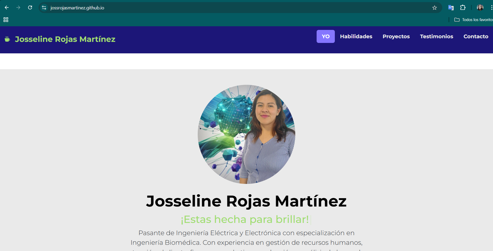

# Portafolio de Proyectos

Hola!😉 Soy **Josseline Rojas Martínez**, pasante de *Ingeniería Eléctrica Electrónica* apacionada por la ***Ingeniería Biomédica*** y la tecnología, por ello soy *desarrolladora web Jr.*, aquí encontraras información sobre mi.

_________

## El proyecto cuenta con las secciones de:

- Perfil 👤
- Habilidades 😎
- Proyectos 🤩
- Testimonios 🫂y 
- Contacto 🫡

## Creado con:

    
    

    

### ¡Espero pronto saber de ti! ###
## Correo:

[josse.martinez12@gmail.com](malito:josse.martinez12@gmail.com)

### Creado en el bootcamp de TecnolochicasPro
[Tecnolochicas💜](https://tecnolochicas.mx/)